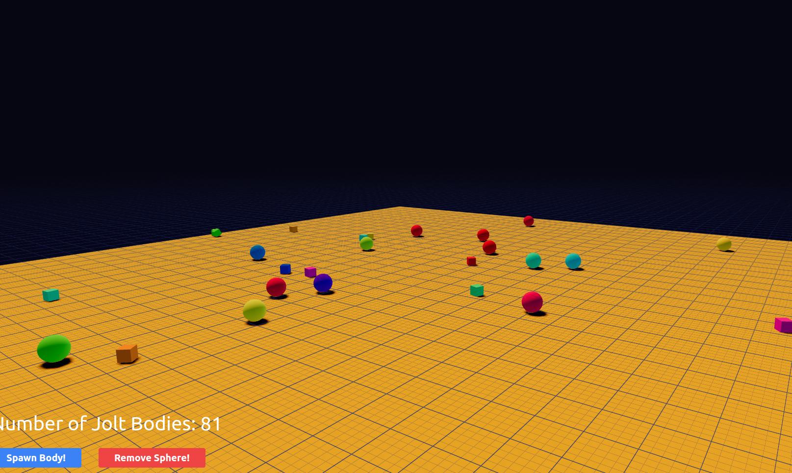

# R3F + Jolt Playground

👉 Check out the [Live Demo](https://codesandbox.io/p/github/Ctrlmonster/koota-jolt-testground/main)

Some Notes:
This is not a full rt/physics library, just a sketch of how the [JoltPhysics](https://github.com/jrouwe/JoltPhysics.js/) library  
can be controlled via [Koota](https://github.com/pmndrs/koota) in r3f. If you're planning on writing a game using Jolt Physics, this
could be used as a starter template. If you're looking for something more integrated, check out [rt/jolt](https://github.com/pmndrs/react-three-jolt). 
**Important**: there is no jolt clean up system yet and bodies can't be removed yet.

## Check out the [Koota repo](https://github.com/pmndrs/koota) ##

 

